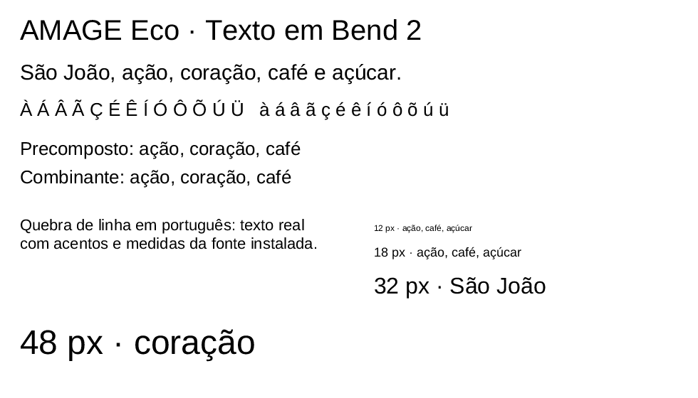

# Dithra

**Anti-aliased rasterization of glyph outlines and vector paths in Bend 2.**

Dithra is the rasterizer of the AMAGE UI ecosystem. It turns closed paths into
coverage masks, and text laid out by Syllo into positioned glyph masks that a
compositor such as Chromi can paint. The whole chain from font file to pixels,
**TrueType file → Runika → Syllo → Dithra → masks**, runs in Bend 2, without a
native font or graphics engine.

**Status:** early Linux implementation, tested with **Bend 2.0.35**. It runs on
the CPU and covers glyph text and filled shapes; it has no glyph cache or
subpixel positioning yet.



The image above was written by `examples/text.bend` as a PGM file and converted
to PNG for display. Font reading, layout, and rasterization all ran in Bend;
the converter only re-encoded the pixels. The font is Liberation Sans.

## What works today

- Quadratic and cubic Bézier flattening, with a geometric chord-error target of
  about 0.125 px and at most 12 subdivision levels (F32 arithmetic, no proven
  error bound).
- Scanline intersections with half-open y intervals, so shared vertices are not
  counted twice; horizontal edges add no intersections.
- `NonZero` and `EvenOdd` fill rules, multiple subpaths, holes, and overlaps.
- 4×4 samples per pixel (centers at 1/8, 3/8, 5/8, 7/8), rounded to coverage
  0–255. Coverage is independent of color.
- Glyph masks from Runika outlines at a physical pixel size, and positioned
  masks for a whole Syllo layout at a given device scale.
- Paths use [Splina](https://github.com/amage-si/splina)'s shared types;
  quadratics from fonts stay quadratic until rasterization.

Dithra's own suite has **15 checks**: analytic coverage of squares (255, 128,
64), overlap under both fill rules, holes, quadratic and cubic coverage, open
paths and paths without `MoveTo`, oversized masks and zero scale, a real space
glyph, and a real accented glyph at 12 and 48 px. `all_tests.bend` runs the
whole text chain, **83 checks**: 51 Runika, 17 Syllo, and 15 Dithra.

Beyond the suites, the examples have been run on Linux: the text demo (ten
blocks of Portuguese at 12–48 px), the integration with
[Tessra](https://github.com/amage-si/tessra) measurements and
[Chromi](https://github.com/amage-si/chromi) composition, and the same frame in
an [Ankra](https://github.com/amage-si/ankra) window (640×160, XWayland), which
opened and closed with exit code 0.

## Quick start

Requirements: the [Bend 2 toolchain](https://bend-lang.com), Clang 14 or newer,
and the sibling repositories cloned next to Dithra under these exact names:

| Repository | Needed for |
| --- | --- |
| [Splina](https://github.com/amage-si/splina) | Everything (path types) |
| [Runika](https://github.com/amage-si/runika), [Syllo](https://github.com/amage-si/syllo) | Glyph and text rendering, tests, examples |
| [Tessra](https://github.com/amage-si/tessra), [Chromi](https://github.com/amage-si/chromi) | `examples/integration.bend` |
| [Ankra](https://github.com/amage-si/ankra) | `examples/window.bend` (also needs X11) |

The tests and examples read Liberation Sans 2.1.5 from
`/usr/share/fonts/liberation/LiberationSans-Regular.ttf`; see Runika's README
for how to obtain that exact file.

```sh
mkdir amage && cd amage
git clone https://github.com/amage-si/dithra.git Dithra
git clone https://github.com/amage-si/splina.git Splina
git clone https://github.com/amage-si/runika.git Runika
git clone https://github.com/amage-si/syllo.git Syllo
git clone https://github.com/amage-si/tessra.git Tessra   # integration example
git clone https://github.com/amage-si/chromi.git Chromi   # integration example
git clone https://github.com/amage-si/ankra.git Ankra     # window example
cd Dithra
export BEND_NO_TELEMETRY=1
bend version
mkdir -p build
bend tests.bend -o build/tests
./build/tests --threads 2 --gpu off
bend all_tests.bend -o build/all-tests
./build/all-tests --threads 2 --gpu off
```

Render the text demo to `build/text.pgm` (980×560, 8-bit grayscale):

```sh
bend examples/text.bend -o build/text
./build/text --threads 2 --gpu off
```

Compose a line through Tessra and Chromi into `build/integration.pgm`, or show
it in a window that closes itself after 180 frames:

```sh
bend examples/integration.bend -o build/integration
./build/integration --threads 2 --gpu off
bend examples/window.bend -o build/window
./build/window --threads 2 --gpu off
```

Run commands from the repository root: the examples write into `build/`.
`bend <file>` without `-o` can run the text demo directly, but a window needs a
native binary.

## Using the API

```bend
import ../Dithra/main.bend as D
import ../Dithra/raster.bend as R

D.render(font, layout, logical_size, device_scale)
  -> Result<&2,&2,String,List<&2,D.PositionedMask>>
D.glyph(font, glyph_id, physical_size) -> Result<&2,&2,String,R.Mask>
R.rasterize(path, scale, advance) -> Result<&2,&2,String,R.Mask>      # font units, y up
R.rasterize_screen(path, advance) -> Result<&2,&2,String,R.Mask>      # pixels, y down
```

A `Mask{width, height, left, top, advance, coverage}` is row-major coverage
0–255, top row first, with exactly `width × height` values. `left` and `top`
are whole-pixel offsets from the glyph origin on the baseline. A
`PositionedMask{x, y, source_start, source_end, mask}` already includes those
offsets, in physical pixels. Read the [API reference](docs/api.md) for units,
scaling, and limits.

## Current boundaries

- CPU only. No glyph cache or atlas: repeated characters are rasterized again.
- Glyph origins are rounded down to whole pixels; there is no subpixel phase.
- 4×4 supersampling, not exact analytic coverage. No LCD/subpixel rendering,
  hinting, or gamma correction; final sRGB composition belongs to Chromi.
- Every subpath needs `MoveTo` and `ClosePath`; open paths are rejected.
  No strokes, vector clipping, or GPU tessellation.
- Limits: 4096 path commands, 32768 edges after flattening, masks up to 1024 px
  per side and 262144 pixels, coordinates within ±1,000,000. Control-point
  bounds are checked before subdivision, so a curve whose control box is much
  larger than its ink can be rejected. Exceeding a limit returns an error, never
  a partial mask.

Cost per sample row: intersections O(E), sorting O(I log I), and the sweep
O(4W + I), with four sample rows per pixel row. On the development machine
(Ryzen 7 5800H, one core, `--threads 1`), the text demo took a median 0.63 s
over three runs, including font loading, layout, rasterization of ten blocks,
and writing the PGM, with a peak RSS of about 50 MiB. This is a single
measurement on a shared machine, not a renderer benchmark, and no advantage
over existing rasterizers is claimed. See [docs/notes.md](docs/notes.md).

## Repository map

| Path | Purpose |
| --- | --- |
| [raster.bend](raster.bend) | Path validation, flattening, scanline coverage, masks. |
| [main.bend](main.bend) | Glyph masks from Runika and positioned masks for Syllo layouts. |
| [tests.bend](tests.bend) | Dithra's native checks. |
| [all_tests.bend](all_tests.bend) | Runika, Syllo, and Dithra checks in one binary. |
| [examples/text.bend](examples/text.bend) | Ten text blocks exported as PGM. |
| [examples/integration.bend](examples/integration.bend) | Syllo → Tessra → Dithra → Chromi, exported as PGM. |
| [examples/window.bend](examples/window.bend) | The integration frame in an Ankra window. |
| [examples/export.bend](examples/export.bend) | Grayscale test surface and PGM writer used by the examples. |
| [docs/api.md](docs/api.md) | Types, coordinate systems, and limits. |
| [docs/notes.md](docs/notes.md) | Measurements and runtime findings. |

## Direction

Next are a glyph cache keyed by font, size, and subpixel phase, active-edge
buckets, and incremental composition, preserving the current contracts. These
are goals, not supported features.

See [CONTRIBUTING.md](CONTRIBUTING.md) for development rules. The API is
experimental and may change. A distribution license has not yet been selected.
